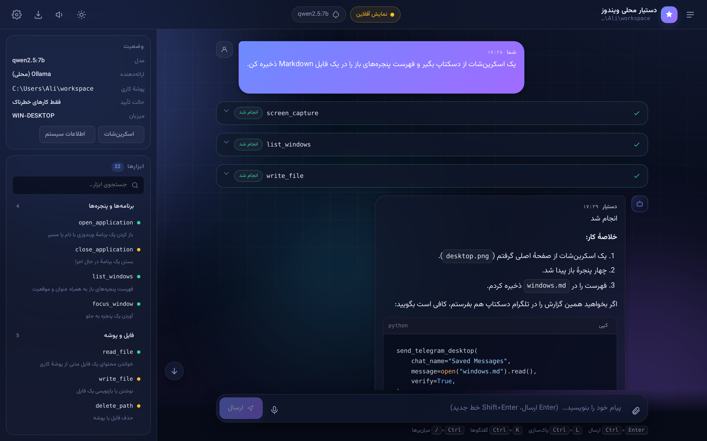
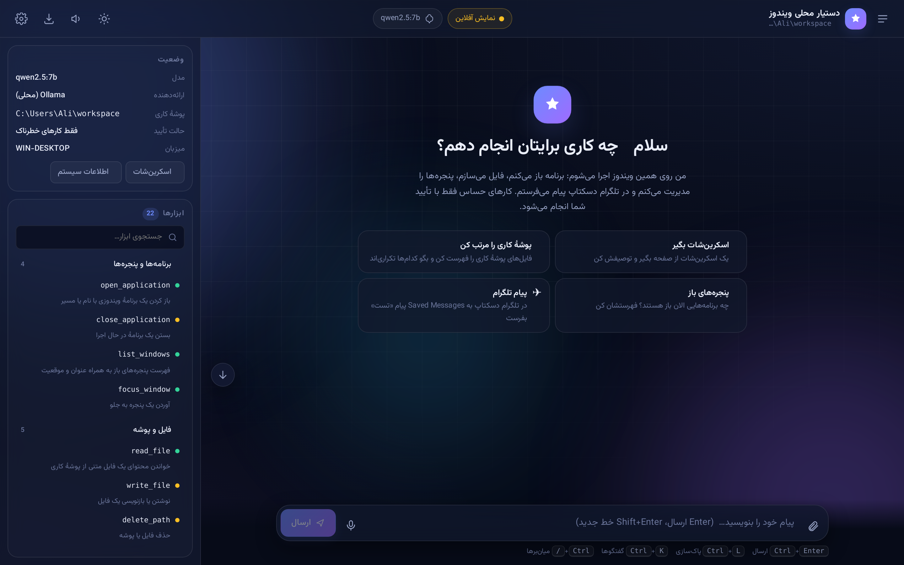
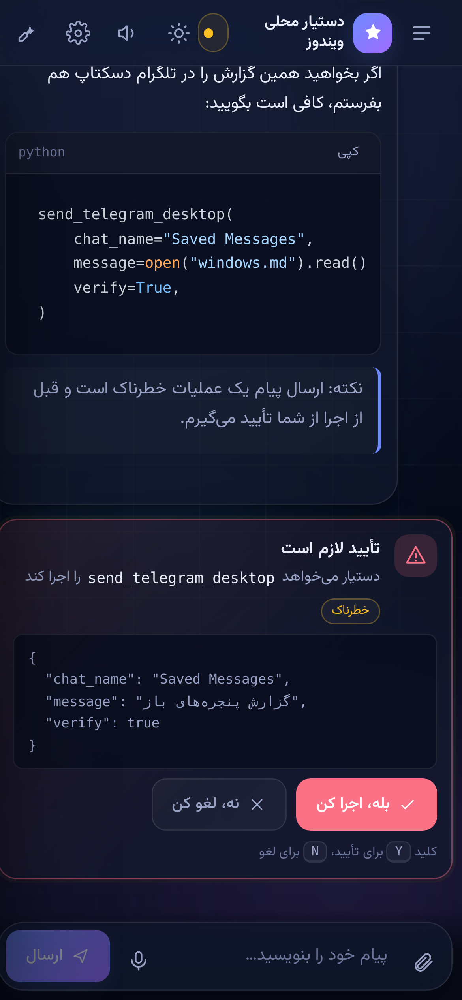
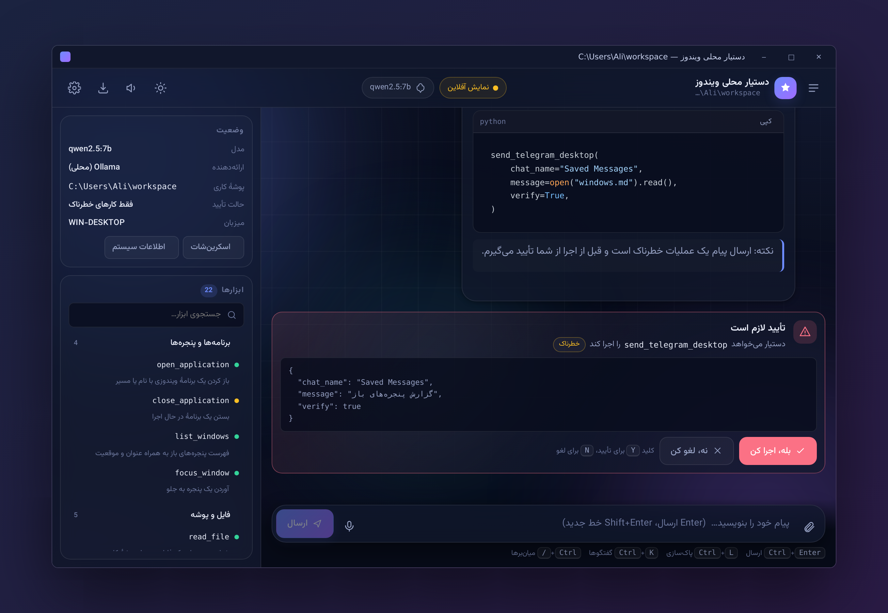

# Local Assistant

یک ایجنت محلی حرفه‌ای برای **دسکتاپ شما** — برخلاف ربات تلگرام/بله
که روی سرور اجرا می‌شود، این ایجنت مستقیماً روی لپ‌تاپ/کامپیوتر شما زندگی
می‌کند و به همه چیز دسترسی دارد:

* باز کردن هر برنامه (Chrome، Telegram Desktop، Photoshop، VS Code، Task Manager و...) — **ویندوز و لینوکس**
* کنترل GUI با ماوس و کیبورد (pyautogui) — drag & drop، کلیک، تایپ
* ارسال پیام از **اکانت شخصی تلگرام شما** (Telethon user client)
* خواندن/نوشتن فایل، اجرای shell command، جستجوی وب
* **کراس‌پلتفرم**: ویندوز، لینوکس دسکتاپ، و سرور لینوکس بدون نمایشگر
* حافظهٔ بلندمدت بین sessionها
* تأیید هوشمند: کارهای امن (باز کردن برنامه، جستجو) مستقیم انجام می‌شود؛ کارهای
  مخرب (ارسال پیام، پاک کردن فایل، kill کردن پروسس) فقط با تأیید شما

> ⚠️ **تفاوت با ربات تلگرام:** ربات تلگرام روی سرور اجرا می‌شود و به ماشین شما
> دسترسی ندارد. این ایجنت روی **خود ماشین شما** اجرا می‌شود و واقعاً تلگرام
> دسکتاپ/فتوشاپ/Task Manager شما را کنترل می‌کند.

## چهار راه استفاده

| رابط | دستور | مناسب برای |
|---|---|---|
| 🖥️ **اپ دسکتاپ** | `python local_agent_setup.py desktop` | استفادهٔ روزمره — پنجرهٔ بومی + tray + هات‌کی |
| 🌐 **رابط وب** | `python local_agent_setup.py web` | مرورگر، از موبایل هم قابل دسترس |
| 🖧 **سرور** | `python local_agent_setup.py web --host 0.0.0.0` | سرور لینوکس بدون نمایشگر |
| ⌨️ **CLI** | `python -m local_agent` | ترمینال، اسکریپت، سرعت |
| ✈️ **ربات تلگرام/بله** | `python local_agent_setup.py bot-telegram` | کنترل از راه دور |

هر چهار رابط **یک حافظه و یک وضعیت مشترک** دارند (نگاه کنید به [BRIDGE.md](BRIDGE.md)).



---

## نصب سریع

### ۱) پیش‌نیازها

* **Windows 10/11** یا **Linux** (روی macOS هم نصب می‌شود ولی فقط بخش‌های محدود کار می‌کنند)
* **Python 3.11+**
* (اختیاری) **Ollama** برای اجرای محلی LLM: [ollama.com](https://ollama.com)
* (اختیاری) **Git Bash** یا **PowerShell** (هر دو کار می‌کنند)

### ۲) نصب

```powershell
# در PowerShell (ویندوز)، داخل پوشهٔ پروژه:
git clone https://github.com/Alirezahjf/AI_Agent_OLLAMA.git
cd AI_Agent_OLLAMA
python -m venv .venv
.venv\Scripts\Activate.ps1
python local_agent_setup.py install-all
```

```bash
# در Bash (لینوکس):
git clone https://github.com/Alirezahjf/AI_Agent_OLLAMA.git
cd AI_Agent_OLLAMA
python -m venv .venv
source .venv/bin/activate
python local_agent_setup.py install-all
```

`install-all` همه چیز را نصب می‌کند:
- runtime اصلی (requests, Pillow, dotenv, rich)
- رابط وب (`fastapi`, `uvicorn`, `pydantic`)
- mouse/keyboard automation (`pyautogui`, `mss`)
- Telegram user client (`telethon`)
- پنجرهٔ بومی و آیکون نوار وظیفه (`pywebview`, `pystray`)

اگر فقط LLM و کارهای read-only می‌خواهید: `python local_agent_setup.py install`

#### نصب دستی با pip (به‌جای اسکریپت)

بسته‌های اختیاری به‌صورت **extra** گروه‌بندی شده‌اند و می‌توانید فقط آنچه لازم دارید را نصب کنید:

| extra | چه چیزی می‌آورد | چه وقت لازم است |
|---|---|---|
| `web` | fastapi، uvicorn، pydantic | رابط وب و اپ دسکتاپ |
| `desktop` | pyautogui، mss، telethon، rich، pyperclip، uiautomation | کنترل ماوس/کیبورد و تلگرام شخصی |
| `app` | pywebview، pystray | پنجرهٔ بومی و آیکون کنار ساعت |
| `all` | هر سهٔ بالا | حالت پیشنهادی برای کاربر ویندوز |
| `dev` | pytest، ruff | توسعه و اجرای تست |

```powershell
pip install -e ".[all]"        # همه‌چیز (پیشنهادی)
pip install -e ".[web]"        # فقط رابط وب
pip install -e ".[all,dev]"    # همه‌چیز + ابزار تست
```

> **نکتهٔ PowerShell:** در PowerShell از **دابل‌کوت** استفاده کنید (`".[all]"`).
> سینگل‌کوت (`'.[all]'`) که در مثال‌های Bash می‌بینید در PowerShell درست تفسیر نمی‌شود.

اگر `pip install -e .` با خطای
`Multiple top-level packages discovered in a flat-layout` شکست خورد، یعنی
نسخهٔ قدیمی `pyproject.toml` را دارید؛ آخرین تغییرات را `git pull` کنید.

**لینوکس — وابستگی‌های اضافی:**

```bash
# برای اپ دسکتاپ (pywebview با GTK):
sudo apt install python3-gi python3-gi-cairo gir1.2-webkit2-4.1
pip install pywebview[gtk]

# برای کلیپ‌بورد:
sudo apt install xclip

# برای ابزارهای پنجره:
sudo apt install wmctrl xdotool
```

### ۳) بررسی نصب (بررسی سلامت)

```powershell
python local_agent_setup.py doctor
```

این دستور یک گزارش کامل فارسی می‌دهد: نسخهٔ پایتون، وابستگی‌ها، دسترسی نوشتن
به پوشه‌ها، درستی `config.json`، **اتصال واقعی به مدل** (AvalAI یا Ollama)،
تعداد ابزارهای فعال، اسکرین‌شات، آزاد بودن پورت، آمادگی اپ دسکتاپ و امنیت ربات‌ها.
هر مورد ناسالم یک راهنمای رفع اشکال کنارش دارد.

گزینه‌های مفید:

```powershell
python local_agent_setup.py doctor --offline   # بدون بررسی شبکه
python -m local_agent.diagnostics --json       # خروجی JSON برای اسکریپت
python -m local_agent.desktop --doctor         # فقط بررسی، بدون باز کردن پنجره
```

همین گزارش از سه جای دیگر هم در دسترس است:

* در رابط وب/دسکتاپ: دکمهٔ **🩺 بررسی سلامت** در پنل کناری (یا منوی راست‌کلیک آیکون نوار وظیفه)
* در ربات تلگرام/بله: دستور `/doctor`
* در CLI: دستور `/doctor`

اگر همه چیز OK بود:

```powershell
python -m local_agent
```

اولین اجرا یک فایل `config.json` در `%USERPROFILE%\.local_assistant\` می‌سازد.
آن را باز کنید و مدل LLM را تنظیم کنید.

### ۴) تنظیم LLM

فایل `%USERPROFILE%\.local_assistant\config.json` را باز کنید:

```json
{
  "llm": {
    "provider": "ollama",
    "ollama_base_url": "http://127.0.0.1:11434",
    "ollama_model": "qwen2.5:7b"
  }
}
```

یا برای GapGPT/AvalAI:

```json
{
  "llm": {
    "provider": "openai_compatible",
    "openai_base_url": "https://api.avalai.ir/v1",
    "openai_api_key": "sk-...",
    "openai_model": "claude-sonnet-5"
  }
}
```

می‌توانید همان مقادیر را با env variable هم override کنید:

```powershell
$env:LOCAL_AGENT_LLM__PROVIDER = "openai_compatible"
$env:LOCAL_AGENT_LLM__OPENAI_API_KEY = "sk-..."
python -m local_agent
```

### ۵) (اختیاری) اتصال تلگرام شخصی

در [my.telegram.org](https://my.telegram.org) یک app بسازید و `api_id` و
`api_hash` بگیرید (یک بار برای همهٔ اکانت‌ها کافی است). سپس در
`config.json`:

```json
{
  "telegram": {
    "enabled": true,
    "active_account": "اصلی",
    "accounts": [
      {
        "name": "اصلی",
        "enabled": true,
        "api_id": 123456,
        "api_hash": "abcdef1234567890abcdef",
        "phone": "+98912...",
        "session_name": "main",
        "confirm_send": true
      },
      {
        "name": "کار",
        "enabled": true,
        "api_id": 123456,
        "api_hash": "abcdef1234567890abcdef",
        "phone": "+98915...",
        "session_name": "work",
        "confirm_send": false
      }
    ]
  }
}
```

با این ساختار چند اکانت دارید؛ هر اکانت یک **سشن جدا** در
`data_dir/sessions/<session_name>.session` دارد و مستقل لاگین می‌شود.
(اگر فیلد `accounts` خالی باشد، از فیلدهای قدیمیِ تک‌اکانتی
`enabled/api_id/api_hash/phone/...` یک اکانت به نام «اصلی» ساخته می‌شود؛
بنابراین configهای قبلی بدون تغییر کار می‌کنند.)

سپس در CLI:

```
/telegram list              لیست اکانت‌ها و اکانت فعال
/telegram use کار           تعویض اکانت فعال
/telegram connect [name]    اتصال به اکانت (کد SMS و در صورت نیاز 2FA)
/telegram status [name]     وضعیت یک اکانت
/telegram disconnect [name] قطع اتصال
/telegram chats             لیست چت‌های اکانت فعال
```

یک‌بار SMS code از شما می‌پرسد (و اگر حساب 2FA دارد، رمز دوم‌مرحله‌ای)؛
سشن در `data_dir/sessions/<session_name>.session` ذخیره می‌شود و بعد از
ری‌استارت **بدون لاگین دوباره** وصل می‌مانید. به محض کامل‌شدن اتصال،
`enabled=True` همان اکانت در `config.json` **persist** می‌شود تا بعد از
ری‌استارت کلاینتش خودکار ساخته شود (فلوی اتصال دیگر اکانت را «disabled»
رها نمی‌کند). دکمهٔ «فعال کن/تعویض» هم اکانت هدف را فعال و فعال‌ترین
می‌کند.

> ⚠️ اگر هنگام اتصال پیام «اتصال به سرور تلگرام برقرار نشد؛ اتصال اینترنت
> را بررسی کنید و در صورت نیاز از فیلترشکن/VPN استفاده کنید» دیدید، یعنی
> config درست است ولی شبکه به سرور تلگرام نمی‌رسد (Telethon با خطای
> «Connection to Telegram failed» شکست خورده) — این ربطی به اکانت یا
> اعتبارنامه ندارد.

در رابط وب هم مودال تنظیمات → بخش «📱 تلگرام شخصی» فلوی
`await_code → await_2fa → connected` را دارد (دکمهٔ «اتصال به تلگرام»)،
یک منوی اکانت‌ها (نام/شماره/وضعیت اتصال + سوییچ «فعال» + دکمهٔ «اتصال»
و «فعال کن/تعویض») برای چند-اکانتی، و سوییچ **«تأیید قبل از ارسال پیام
تلگرام»** که معادل `telegram.confirm_send` است. اکانت فعال در نوار بالای
صفحه هم نمایش داده می‌شود و `telegram.list_accounts` وضعیت «فعال/غیرفعال»
هر اکانت را جدا نشان می‌دهد.

**خود-تنظیم با چت:** اگر به ایجنت بگویید «به تلگرامم وصل شو»، خودش چک
می‌کند که `api_id`/`api_hash`/`phone` ثبت شده‌اند یا نه؛ اگر نه، از شما
می‌خواهد از [my.telegram.org](https://my.telegram.org) بگیرید و با ابزار
`config_set` در `config.json` ذخیره می‌کند (مقادیر محرمانه هرگز در پاسخ
چاپ نمی‌شوند) و سپس شما را به دکمهٔ اتصال راهنمایی می‌کند.

---

### ۶) (اختیاری) اتصال جیمیل

بخش `gmail` در `config.json`:

```json
{
  "gmail": {
    "enabled": true,
    "credentials_file": "credentials.json",
    "token_file": "gmail_token.json",
    "username": "you@gmail.com",
    "app_password": "",
    "confirm_send": true
  }
}
```

دو روش:

* **OAuth2 (ترجیحی):** در [Google Cloud Console](https://console.cloud.google.com)
  یک پروژه بسازید، Gmail API را فعال کنید و یک **OAuth Client از نوع
  Desktop app** بسازید؛ فایل JSON را با نام `credentials.json` در پوشهٔ داده
  (پیش‌فرض `~/.local_assistant`) بگذارید. وابستگی‌ها با
  `pip install -e ".[gmail]"` نصب می‌شوند (در بستهٔ پایه نیستند تا بیلد
  ویندوز سبک بماند). در اولین اتصال مرورگر باز می‌شود و یک‌بار تأیید
  می‌گیرید؛ توکن در `gmail_token.json` ذخیره و بعداً خودکار refresh می‌شود.
* **IMAP/SMTP با App Password (بدون وابستگی جدید):** تأیید دومرحله‌ای
  گوگل را فعال کنید و یک App Password ۱۶ رقمی بسازید؛ `username` (آدرس
  جیمیل) و `app_password` را در config یا مودال تنظیمات وب وارد کنید.

اکشن‌ها: `gmail.list_unread(limit)`، `gmail.search(query, limit)`،
`gmail.read(id)` (Safe)، `gmail.send(to, subject, body)` (Destructive +
تأیید، با احترام به `gmail.confirm_send`) و `gmail.reply(id, body)`.
دکمهٔ اتصال/قطع در مودال تنظیمات وب و وضعیت در `/api/status` موجود است.

نکته‌های مهم برای فرستادن ایمیل:

* **HTML:** اگر `body` شامل HTML معنادار باشد (یا با `<html`/`<!DOCTYPE`
  شروع شود)، خود برنامه آن را به‌صورت **multipart/alternative** می‌فرستد:
  یک بخش `text/plain` (سلب‌شده از HTML) + بخش `text/html` — گیرنده حالت
  بصری می‌بیند و کلاینت‌های ضعیف هم متن ساده دارند. دیگر لازم نیست به مدل
  بگویید «HTML بفرست»؛ خودش تشخیص می‌دهد.
* **گیرنده (`to`):** فقط به‌صورت خام `name@domain` قبول می‌شود؛ لینک‌های
  Markdown مثل `[a@b.com](mailto:a@b.com)` به‌طور خودکار به آدرس واقعی
  تمیز می‌شوند و آدرس نامعتبر خطای فارسی می‌دهد.
* **موضوع فارسی:** هدرهای RFC 2047 (مثل `=?UTF-8?B?...?=`) خودکار دیکد
  می‌شوند و در `list_unread`/`read`/`search` موضوع درست دیده می‌شود.
* **پیوست:** مسیرهای نسبی از پوشهٔ کاری (workspace) باز می‌شوند؛ فایل‌هایی
  که در چت ضمیمه کرده‌اید همان‌جا هستند و کافی است نامشان را در
  `attachments` بدهید (نیازی به جست‌وجو/دانلود نیست). مسیر مطلق هم عادی
  کار می‌کند.
* **`gmail.download_attachment(id, filename)`:** `id` باید **شناسهٔ عددی
  خودِ ایمیل** باشد (از `gmail.list_unread`/`search` بگیرید)، نه نام فایل؛
  اگر عددی نباشد خطای فارسی «شناسهٔ ایمیل باید عددی باشد» می‌گیرید و
  خطای خام IMAP به شما/مدل نمی‌رسد.

---

### ۷) (اختیاری) یادآوری و کار زمان‌بندی‌شده

می‌توانید روی سیستم «تایم» ست کنید و دستیار سرِ همان زمان یک **اعلان**
نشان دهد یا یک **کار مشخص را خودکار اجرا کند**:

* `schedule_reminder(at, message)` — یادآوری؛ سرِ موعد یک اعلان دسکتاپ
  (ویندوز: toast از طریق plyer/win10toast، لینوکس: `notify-send`) و یک
  اعلان مرورگر (Notification API) نمایش داده می‌شود.
* `schedule_task(at, action_name, arguments)` — سرِ موعد یک اکشن ثبت‌شده
  را اجرا می‌کند (مثلاً «یک ساعت بعد این پیام را در تلگرام بفرست») و
  نتیجه را به‌صورت رویداد/اعلان اعلام می‌کند. **Destructive** است و هنگام
  ثبت، تأیید کاربر را می‌گیرد.
* `list_scheduled_jobs()` و `cancel_scheduled_job(id)` — مدیریت کارها.

فرمت `at`: رشتهٔ ISO (مثل `2026-08-06T18:30`)، «در HH:MM» (امروز؛ اگر
گذشته بود فردا)، یا عبارت‌های نسبی فارسی («تا ۵ دقیقه دیگر»، «یک ساعت
دیگر» — اعداد فارسی هم قبول است).

کارها در `data_dir/scheduled.json` ذخیره می‌شوند و بعد از ری‌استارت
می‌مانند؛ یک ریسمان دیمون هر ~۳۰ ثانیه موعدها را چک می‌کند. رویداد
`scheduled_fired` روی WebSocket به همهٔ کلاینت‌ها پخش می‌شود. (اعلان
دسکتاپ ویندوز نیازمند تأیید روی ویندوز ۱۱ واقعی است؛ در تست‌ها mock شده.)

---

### ۸) (اختیاری) دسترسی کامل سیستم (Admin/Root)

فیلد `safety.full_system_access` (پیش‌فرض **خاموش**):

* **خاموش (پیش‌فرض):** ابزارهای فایل فقط داخل `work_dir` و شل محدود به
  فضای کاری (طبق `restrict_shell_to_workdir`).
* **روشن:** ابزارهای فایل کل فایل‌سیستم را می‌بینند و شل با `working_dir`
  (cd حالت‌دار) در هر پوشه‌ای اجرا می‌شود. فایل‌های حساس
  (`.ssh`، `.env`، `credentials.json` و...) **در هر دو حالت** مسدودند و
  کارهای مخرب همچنان تأیید می‌گیرند.

سطح دسترسی واقعی فرایند (`admin`/`root`/`user`) در `/api/status` و مودال
تنظیمات نمایش داده می‌شود؛ اگر دسترسی کامل فعال است ولی برنامه سطح
پایین اجرا شده، دکمهٔ «اجرای دوباره به‌عنوان administrator» (ویندوز، UAC)
یا راهنمای `sudo` (لینوکس) نشان داده می‌شود.

---

## استفاده

### دستورات CLI

| دستور | کار |
|---|---|
| `/help` | راهنما |
| `/status` | مدل، provider، تعداد پیام‌ها |
| `/doctor` | بررسی سلامت نصب و اتصال مدل |
| `/actions` | لیست همهٔ ابزارهای موجود |
| `/model NAME` | تغییر مدل (مثلاً `/model claude-sonnet-5`) |
| `/provider NAME` | تغییر provider (ollama / openai_compatible / auto) |
| `/approve` | روشن/خاموش‌کردن auto-approve |
| `/confirm MODE` | تنظیم confirm: `destructive` (پیش‌فرض) / `always` / `never` |
| `/reset` | پاک‌کردن حافظهٔ گفتگو |
| `/screenshot` | اسکرین‌شات از صفحه (نام یکتا، بدون بازنویسی) |
| `/telegram connect` | اتصال به تلگرام شخصی (کد SMS و در صورت نیاز 2FA) |
| `/telegram status` | وضعیت اتصال تلگرام شخصی |
| `/telegram chats` | لیست چت‌ها |
| `/telegram disconnect` | قطع اتصال تلگرام شخصی |
| `/send NAME TEXT` | ارسال سریع پیام |
| `/quit` | خروج |

> نکته: `/approve` و `/confirm` تنظیمات سطح Bridge هستند؛ از مودال تنظیمات
> رابط وب یا `config.json` (فیلد `safety.confirm_mode`) تغییرشان دهید.

### مثال‌ها

```
you > تلگرام رو باز کن
assistant > تلگرام دسکتاپ در حال باز شدن...
  action open_application: started telegram (pid=1234)
assistant > تلگرام باز شد. می‌خواهی به چه کسی پیام بدم؟

you > به علی پیام بده "سلام، ۵ دقیقه دیگه می‌رسم"
assistant > ابتدا لیست چت‌ها رو می‌گیرم...
  action telegram.list_chats: 30 chats loaded
  action telegram.send_message: message sent
assistant > پیام فرستاده شد. ✅

you > مرورگر Chrome رو باز کن و عبارت "آب و هوای تهران" رو سرچ کن
assistant > Chrome رو باز می‌کنم و سرچ می‌کنم.
  action open_application: started chrome
  action type_text: typed 32 characters
  action key_press: pressed enter
assistant > سرچ انجام شد. گوگل نتایج رو نشون داد.

you > فتوشاپ رو باز کن و فایل c:\Users\me\Pictures\photo.jpg رو باز کن
assistant > فتوشاپ رو باز می‌کنم و فایل رو درگ می‌کنم.
  action open_application: started photoshop
  ⚠ approval required: drag_to from=(100,100) to=(500,500)
  approve? [y/N/d(etails)/a(lways-yes)]: y
  action drag_to: dragged (100,100) -> (500,500)
assistant > انجام شد. ✅

you > تسک منیجر رو باز کن و همهٔ Chrome ها رو ببند
assistant > تسک منیجر باز می‌شه و Chrome ها بسته می‌شن.
  action open_application: started taskmgr
  ⚠ approval required: close_application name=chrome
  approve? [y/N]: y
  action close_application: closed chrome (exit 0)
```

---

## رابط وب

```powershell
python local_agent_setup.py web     # http://127.0.0.1:7824
```

یک single-page app فارسی و RTL با حالت تاریک پیش‌فرض:

* **پاسخ کلمه‌به‌کلمه (streaming)** — متن مدل همان‌طور که تولید می‌شود تایپ می‌شود
* نوار هشدار فارسی وقتی Ollama بالا نیست یا کلید API وارد نشده
* پنل **🩺 بررسی سلامت** با دکمهٔ «کپی گزارش» و دکمهٔ «اتصال سریع به AvalAI»
* رندر Markdown با رنگ‌آمیزی کد و دکمهٔ کپی
* کارت اجرای ابزار به‌صورت زنده (در انتظار / در حال اجرا / انجام شد / خطا)
* دیالوگ تأیید با هایلایت خطر
* سایدبار گفتگوها، مودال تنظیمات، پنل ابزارها
* درگ‌اند‌دراپ فایل، ورودی صوتی، خروجی Markdown/JSON
* کاملاً واکنش‌گرا — از موبایل هم می‌توانید وضعیت را ببینید

<p align="center">
  
  &nbsp;
  
</p>

همهٔ کتابخانه‌ها (Alpine.js، marked، highlight.js، فونت وزیرمتن) داخل
پروژه هستند؛ رابط **بدون اینترنت** هم کامل کار می‌کند.

📖 جزئیات کامل سیستم طراحی: [WEB_UI.md](WEB_UI.md)

---

## اپ دسکتاپ

```powershell
python local_agent_setup.py desktop
```



یک برنامهٔ بومی ویندوز (با pywebview روی Edge WebView2):

* پنجرهٔ ۱۲۰۰×۸۰۰، قابل تغییر اندازه، عنوانش مسیر پوشهٔ کاری را نشان می‌دهد
* **اندازهٔ پنجره به خاطر سپرده می‌شود** — دفعهٔ بعد با همان ابعاد باز می‌شود
* **بررسی سلامت خودکار** هنگام اجرا؛ اگر ایرادی باشد یک اعلان بومی می‌بینید
* **آیکون کنار ساعت** با منوی راست‌کلیک (نمایش، پوشهٔ کاری، تنظیمات، بررسی سلامت، خروج)
* **کلید میان‌بر سراسری** <kbd>Ctrl</kbd>+<kbd>Alt</kbd>+<kbd>A</kbd> از هر جای ویندوز
* **نوتیفیکیشن ویندوز** هنگام درخواست تأیید، پایان کار، یا خطا
* دکمهٔ ✕ در tray پنهان می‌کند (نمی‌بندد)
* **تک‌نمونه** — اجرای دوم، پنجرهٔ موجود را جلو می‌آورد
* اجرای خودکار با ویندوز (قابل تنظیم از خود برنامه)
* بسته‌بندی به یک `.exe` با PyInstaller و اینستالر با Inno Setup

```powershell
python local_agent_setup.py build-desktop              # dist\PersianLocalAssistant.exe
python local_agent_setup.py build-desktop --installer  # + اینستالر
```

📖 راهنمای کامل: [DESKTOP.md](DESKTOP.md)

---

## لیست کامل ابزارها

### کنترل برنامه‌ها (Safe)
- `open_application(name, arguments, working_dir, wait, timeout)`
- `close_application(name, force)` — Destructive
- `focus_window(title)`
- `list_applications(filter)`
- `locate_application(name)`

### کنترل پنجره‌ها (Safe)
- `list_windows(filter)`
- `move_window(title, x, y, width, height)`
- `minimize_window(title)`
- `maximize_window(title)`

### کنترل پروسس‌ها
- `list_processes(filter, max_results)` — Safe
- `kill_process(pid)` — System
- `open_task_manager()` — Safe

### Clipboard (Safe)
- `clipboard_read()`
- `clipboard_write(text)`

### فایل
- `read_file(path, start_line, max_lines)` — Safe
- `write_file(path, content)` — Destructive
- `list_directory(path)` — Safe
- `make_directory(path)` — Destructive
- `move_path(source, destination)` — Destructive
- `delete_path(path, recursive)` — System
- `search_files(query, path, max_results)` — Safe

### وب (Safe)
- `web_search(query, max_results)`
- `web_fetch(url, max_chars)`

### Shell و سیستم
- `run_shell(command, working_dir, timeout)` — Destructive
- `system_info()` — Safe
- `open_path(path)` — Safe
- `shutdown_computer(delay_seconds, restart)` — System
- `cancel_shutdown()` — System

### GUI Automation (Safe، فقط روی Windows)
- `screen_capture(filename)`
- `mouse_move(x, y, duration)`
- `mouse_click(x, y, button, clicks)`
- `mouse_double_click(x, y)`
- `type_text(text, interval)`
- `key_press(key)`
- `hotkey(keys)`
- `scroll(x, y, amount)`
- `drag_to(from_x, from_y, to_x, to_y, duration)`
- `get_mouse_position()`
- `get_screen_size()`

### تلگرام شخصی (نیاز به `/telegram connect` یا دکمهٔ اتصال در وب)
همهٔ اکشن‌ها یک پارامتر اختیاری `account` دارند (پیش‌فرض: اکانت فعال) و
اکشن‌های ارسال به `confirm_send` همان اکانت احترام می‌گذارند.

- `telegram.list_accounts()` — Safe
- `telegram.switch_account(name)` — Safe
- `telegram.list_chats(limit)` — Safe
- `telegram.search_messages(chat, query, limit)` — Safe
- `telegram.get_me()` — Safe
- `telegram.search_contacts(query, limit)` — Safe
- `telegram.get_chat_history(chat, limit, offset_id)` — Safe
- `telegram.get_profile(chat)` — Safe (عکس → `data_dir/media/`)
- `telegram.download_media(chat, msg_id, filename)` — Safe (به `data_dir/media/`)
- `telegram.mark_read(chat)` — Safe
- `telegram.resolve_username(username)` — Safe
- `telegram.send_message(chat, text)` — Destructive (احترام به `telegram.confirm_send`)
- `telegram.send_photo(chat, path, caption)` — Destructive
- `telegram.send_file(chat, path, caption)` — Destructive
- `telegram.send_video / send_voice / send_audio / send_document / send_sticker / send_animation` — Destructive
- `telegram.send_location(chat, lat, lng)` — Destructive
- `telegram.reply_to(chat, msg_id, text)` — Destructive
- `telegram.forward_message(chat, from_chat, msg_id)` — Destructive

«Saved Messages» خودِ شما با نام‌های «خودم» / «Saved Messages» / «saved»
قابل هدف است. وقتی Telethon فعال است، ابزار `send_telegram_desktop`
(GUI) از کار می‌افتد تا مدل فقط از `telegram.*` استفاده کند.

### جیمیل (نیاز به اتصال در مودال تنظیمات وب)
- `gmail.list_unread(limit)` — Safe
- `gmail.search(query, limit)` — Safe
- `gmail.read(id)` — Safe (متن کامل + فهرست پیوست‌ها)
- `gmail.send(to, subject, body, attachments)` — Destructive (احترام به `gmail.confirm_send`)
- `gmail.download_attachment(id, filename)` — Safe (به `data_dir/gmail/`)؛ `id` عددی است
- `gmail.reply(id, body, attachments)` — Destructive

سوییچ «تأیید قبل از ارسال ایمیل» در مودال تنظیمات وب معادل
`gmail.confirm_send` است. (HTML خودکار multipart/alternative می‌شود؛
گیرندهٔ Markdown تمیز می‌شود؛ هدرهای RFC 2047 دیکد می‌شوند؛ پیوست‌های
نسبی از workspace باز می‌شوند — ببینید «۶) اتصال جیمیل».)

### زمان‌بندی (یادآوری و کار خودکار)
- `schedule_reminder(at, message)` — Safe (اعلان سرِ موعد)
- `schedule_task(at, action_name, arguments)` — Destructive (اجرای اکشن سرِ موعد)
- `list_scheduled_jobs()` — Safe
- `cancel_scheduled_job(id)` — Safe

کارها در `data_dir/scheduled.json` ذخیره و بعد از ری‌استارت بازگردانده
می‌شوند؛ رویداد `scheduled_fired` به همهٔ کلاینت‌های وب پخش می‌شود.
(ببینید «۷) یادآوری و کار زمان‌بندی‌شده».)

### تنظیمات (persist بین ری‌استارت‌ها)
- `config_set(path, value)` — نوشتن هر تنظیم نقطه‌چین (مثل `telegram.api_id`
  یا `work_dir`) در `config.json` با نوشت اتومیک؛ مقادیر محرمانه در خروجی
  چاپ نمی‌شوند.

همهٔ تغییرات مودال تنظیمات وب (provider، مدل، کلید API، confirm mode،
`work_dir`، تلگرام، جیمیل، `full_system_access`) بلافاصله در `config.json`
ذخیره می‌شوند و بعد از ری‌استارت می‌مانند. فایل تنظیمات **یک منبع حقیقت**
دارد: اول `LOCAL_AGENT_CONFIG`، بعد `~/.local_assistant/config.json` اگر
وجود داشته باشد، و اگر نه، به‌دنبال `config.json` واقعی در
`LOCAL_AGENT_DATA_DIR` / پوشهٔ جاری / پوشهٔ پروژه می‌گردد (اولین فایلی که
«تنظیمات واقعی» داشته باشد). همیشه همان‌جا خوانده/نوشته می‌شود؛
`data_dir` فقط محل لاگ/تاریخچه/سشن/اسکرین‌شات است. اگر config قدیمی در
جای دیگری پیدا شود، مقادیرش یک‌بار با لاگ فارسی به مسیر اصلی منتقل
می‌شوند (مهاجرت خودکار) و doctor دربارهٔ فایل‌های «سرگردان» هشدار
می‌دهد.

**هر تب چت یک سشن مستقل است:** تاریخچهٔ هر تب در
`data_dir/history/<session_id>.jsonl` ذخیره می‌شود و ران‌های تب‌های
هم‌زمان با هم تداخل ندارند (حداکثر ۲۰ سشن زنده؛ سشن‌های ۲۴ ساعت
بلااستفاده بسته می‌شوند).

---

## معماری

```
local_agent/
├── __init__.py
├── __main__.py              ← python -m local_agent
├── core/
│   ├── config.py            ← AssistantSettings (frozen dataclass)
│   ├── context.py           ← RuntimeContext (history + events)
│   ├── errors.py            ← AssistantError, ActionRefused, ...
│   └── logging_setup.py
├── llm/
│   ├── client.py            ← OllamaClient + OpenAICompatibleClient
│   └── errors.py
├── actions/
│   ├── registry.py          ← ActionRegistry, ConfirmationGate, Risk
│   ├── app_control.py       ← open_application, close_application
│   ├── window_control.py    ← list_windows, move_window
│   ├── process_control.py   ← list_processes, kill_process
│   ├── clipboard.py         ← clipboard_read, clipboard_write
│   ├── file_ops.py          ← read_file, write_file, ...
│   ├── web.py               ← web_search, web_fetch
│   ├── system.py            ← run_shell, shutdown_computer
│   └── runner.py
├── automation/
│   ├── gui.py               ← pyautogui wrapper
│   └── screenshot.py        ← mss + PIL fallback
├── telegram/
│   └── client.py            ← Telethon user client wrapper
├── cli/
│   ├── app.py               ← main REPL
│   ├── render.py            ← Rich terminal renderer
│   └── prompts.py           ← dynamic system prompt builder
├── bridge/                  ← daemon مشترک همهٔ رابط‌ها (BRIDGE.md)
│   ├── protocol.py          ← پیام‌های typed
│   ├── api/                 ← BridgeClient + handlers (agent loop)
│   ├── server/              ← HTTP + SSE
│   └── telegram_bot/        ← ربات تلگرام/بله
├── web/                     ← رابط وب (WEB_UI.md)
│   ├── app.py               ← FastAPI + WebSocket
│   ├── templates/index.html
│   └── static/              ← style.css, app.js, vendor/
├── desktop/                 ← اپ دسکتاپ ویندوز (DESKTOP.md)
│   ├── app.py               ← پنجرهٔ pywebview + JS API
│   ├── tray.py              ← آیکون و منوی tray
│   ├── hotkey.py            ← کلید میان‌بر سراسری
│   ├── single_instance.py   ← قفل تک‌نمونه
│   ├── autostart.py         ← اجرای خودکار با ویندوز
│   ├── updater.py           ← بررسی release در GitHub
│   ├── build.py             ← ساخت exe با PyInstaller
│   └── installer.iss        ← اسکریپت Inno Setup
└── utils/
    └── platform.py          ← Windows helpers (registry, UWP, ctypes)

local_agent_setup.py         ← installer / doctor / config opener
```

---

## تست

```powershell
.venv\Scripts\Activate.ps1
python -m pytest tests_local_agent/ -v
```

**۲۸۶ تست** (به‌علاوهٔ ۱۸ تست مرورگری که با نصب Playwright فعال می‌شوند):

| حوزه | تعداد |
|---|---|
| config، context، actions، file ops | ۳۸ |
| LLM client (ollama + openai-compatible) | ۱۵+ |
| Bridge: protocol، handlers، HTTP/SSE، یکپارچگی | ۳۱ |
| رابط وب: markup، asset، endpoint | ۲۰ |
| اپ دسکتاپ: tray، هات‌کی، قفل، آپدیتر، بیلد | ۶۸ |
| GUI automation و تلگرام | ۱۳ |
| بقیه (CLI، platform، ربات) | باقی |

تست‌های مرورگری رابط وب:

```powershell
pip install playwright
playwright install chromium
python -m pytest tests_local_agent/test_web_render.py -v
```

اگر مرورگری نصب نباشد این تست‌ها بی‌سروصدا skip می‌شوند.

---

## امنیت

* **همیشه تأیید برای کارهای مخرب:** ارسال پیام، پاک کردن فایل، kill کردن پروسس، shutdown.
* **کلید API:** اگر در `config.json` بگذارید، در فایل ذخیره می‌شود. برای امنیت بیشتر از env variable استفاده کنید (`LOCAL_AGENT_LLM__OPENAI_API_KEY`).
* **Shell:** `run_shell` مخرب است — اگر می‌خواهید محدود به work_dir شود، `safety.restrict_shell_to_workdir` را true کنید.
* **Telethon session:** فایل `<session_name>.session` معادل لاگین کامل است. آن را جای امن نگه دارید.

---

## سوالات متداول

**آیا می‌توانم از این ایجنت در کالی لینوکس هم استفاده کنم؟**
CLI اجرا می‌شود ولی فقط ابزارهای read-only (جستجوی وب، file ops، system_info) کار می‌کنند. mouse/keyboard فقط روی Windows.

**آیا می‌توانم همزمان با ربات تلگرام از این ایجنت استفاده کنم؟**
بله، کاملاً مستقل هستند. ربات روی سرور، ایجنت روی دسکتاپ شما.

**چه مدلی پیشنهاد می‌کنید؟**
- برای local: `qwen2.5:7b` (سریع، رایگان، کیفیت خوب)
- برای cloud: `claude-sonnet-5` از AvalAI (قوی‌ترین برای فارسی)
- برای کد: `kimi-k2.7-code` (context بلند)

**آیا می‌توانم یک مدل خاص فقط برای یک task استفاده کنم؟**
بله، با `/model NAME` می‌توانید وسط کار عوض کنید.

**تفاوت با Hermes Agent و Claude Code چیست؟**
- این ایجنت **واقعاً دسکتاپ شما را کنترل می‌کند** (pyautogui + Telethon).
- اکانت شخصی تلگرام شما را دارد (نه فقط bot).
- سه رابط دارد: اپ دسکتاپ بومی، رابط وب، و CLI — با حافظهٔ مشترک.
- متن‌باز، بدون subscription، روی ماشین خودتان.

## ابزار حرفه‌ای تلگرام شخصی

این پروژه به ربات تلگرام وصل نمی‌شود؛ ابزارهای `telegram.*` مستقیماً (با Telethon و سشن مستقل هر اکانت) کار می‌کنند. ابزارهای حساب شامل `list_accounts`، `add_account`، `remove_account`، `switch_account` و `get_me` است. برای چت‌ها `list_chats(kind=private|group|supergroup|channel|bot|all)` اطلاعات زنده را مستقیماً از تلگرام می‌خواند، فیلتر را پیش از محدودیت تعداد اعمال می‌کند و هر نتیجه شناسه عددی و برچسب نوع دارد؛ `group` برای سازگاری شامل سوپرگروه‌ها نیز هست. `list_contacts` و `search_contacts` نیز در هر فراخوانی دفترچهٔ مخاطبین جاری تلگرام را بدون اتکا به کش برنامه دریافت می‌کنند. `resolve_target` شناسه، نام کاربری، شماره، نام مخاطب و عنوان چت را با دادهٔ زنده حل می‌کند و در صورت هم‌نامی هیچ مقصدی را خودکار انتخاب نمی‌کند. تاریخچه و جست‌وجوی پیام شناسهٔ پیام/فرستنده، نوع رسانه، reply، بازدید و فوروارد را برمی‌گردانند و پروفایل، اطلاعات کامل کاربر/گروه/کانال را در صورت دسترسی از API کامل تلگرام می‌خواند. عملیات خواندن، تاریخچه، جست‌وجو، پروفایل و دریافت مدیا امن‌اند؛ ارسال، پاسخ، فوروارد و حذف destructive و نیازمند تأیید هستند.

سشن موجود هنگام راه‌اندازی در پس‌زمینه (حداکثر دو اتصال هم‌زمان) امتحان می‌شود و وضعیت/خطا به رابط وب پخش می‌گردد. قطع دستی دوباره‌وصل نمی‌شود؛ اتصال مجدد خودکار برای افت شبکه طراحی شده است. هیچ api_hash، کد یا رمز در status، لاگ یا خروجی ابزار برگردانده نمی‌شود.

## پایداری جیمیل

Backend IMAP هنگام EOF یا خطای سوکت یک‌بار اتصال را می‌بندد، login مجدد می‌کند و عملیات را تکرار می‌کند. فرستنده با `name <address>` ساده‌سازی می‌شود تا Markdown یا لینک mailto وارد خروجی مدل نشود. OAuth و IMAP واقعی و لاگین واقعی تلگرام باید روی Windows 11 تأیید شوند.
