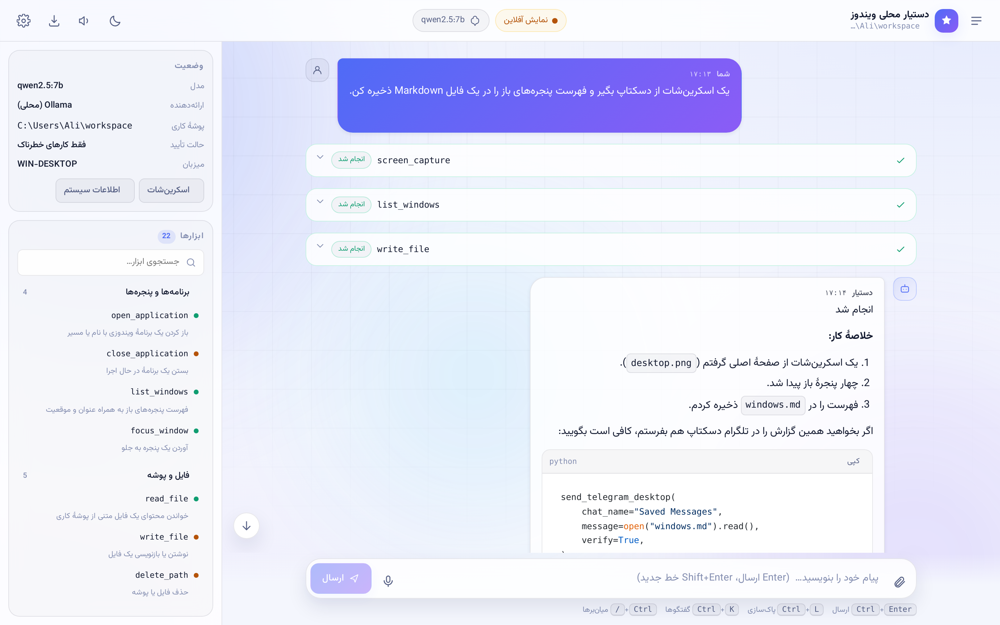
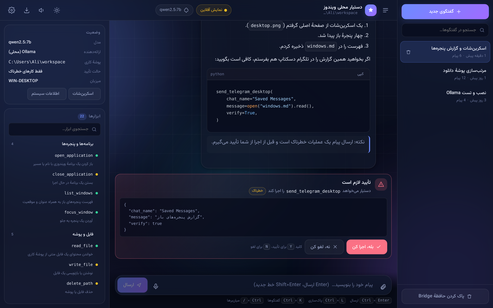
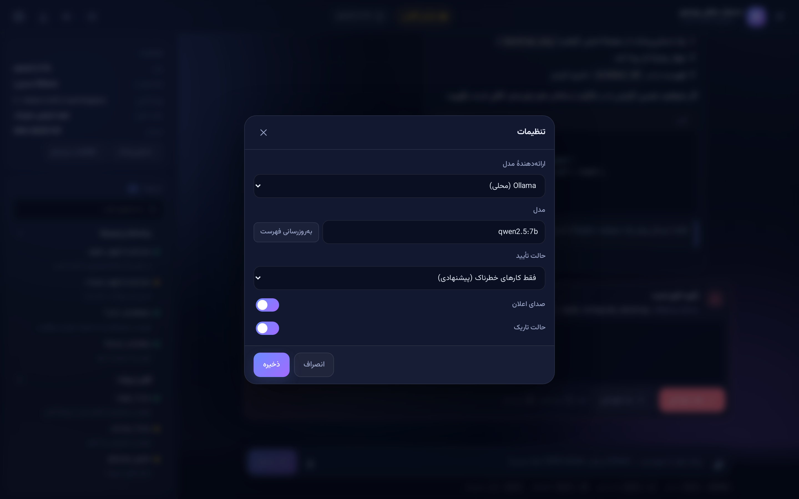
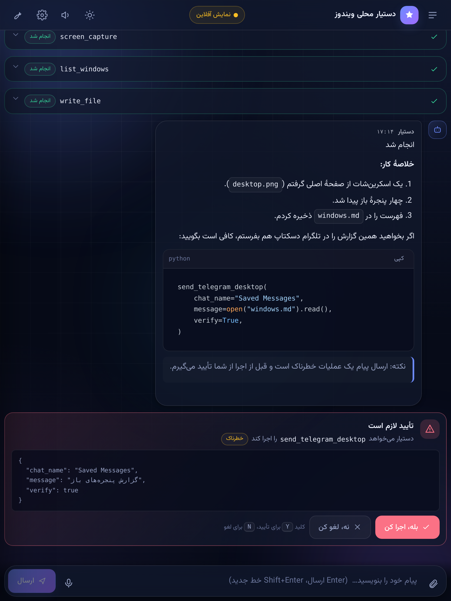

# رابط وب — سیستم طراحی

رابط وب دستیار محلی یک **single-page app** فارسی و RTL است که مستقیماً
روی Bridge سوار می‌شود. همان رابط، بدون هیچ تغییری، داخل [اپ
دسکتاپ](DESKTOP.md) هم اجرا می‌شود.

```powershell
python local_agent_setup.py web     # http://127.0.0.1:7824
```


---

## فهرست

- [اجرا](#اجرا)
- [پشتهٔ فنی](#پشتهٔ-فنی)
- [سیستم طراحی](#سیستم-طراحی)
- [اجزای رابط](#اجزای-رابط)
- [میان‌برهای صفحه‌کلید](#میانبرهای-صفحهکلید)
- [واکنش‌گرایی](#واکنشگرایی)
- [API](#api)
- [توسعه](#توسعه)

---

## اجرا

سه راه برای دیدن رابط:

| روش | دستور | کاربرد |
|---|---|---|
| سرور محلی | `python local_agent_setup.py web` | استفادهٔ واقعی |
| اپ دسکتاپ | `python local_agent_setup.py desktop` | پنجرهٔ بومی ویندوز |
| مستقیم از دیسک | باز کردن `local_agent/web/templates/index.html` در مرورگر | مرور طراحی بدون بک‌اند |

در حالت سوم رابط وارد **«نمایش آفلاین»** می‌شود: با دادهٔ نمونه پر
می‌شود تا بشود طراحی را بررسی کرد، و نشانگر بالای صفحه هم صریحاً
می‌گوید که به Bridge وصل نیست.

---

## پشتهٔ فنی

بدون build step، بدون Node، بدون CDN — همهٔ کتابخانه‌ها داخل
`static/vendor/` قرار دارند تا رابط کاملاً آفلاین کار کند:

| کتابخانه | نسخه | حجم | نقش |
|---|---|---|---|
| [Alpine.js](https://alpinejs.dev) | 3.14 | ۴۴ KB | واکنش‌پذیری و state |
| [marked](https://marked.js.org) | 12.0 | ۳۵ KB | رندر Markdown |
| [highlight.js](https://highlightjs.org) | 11.9 | ۱۲۲ KB | رنگ‌آمیزی کد |
| [Vazirmatn](https://github.com/rastikerdar/vazirmatn) | 33.0 | ۳×۵۰ KB | فونت فارسی |

مجموعاً حدود **۳۷۰ KB** — یک‌بار دانلود، بدون وابستگی به اینترنت.

> چرا CDN نه؟ چون دستیار روی ماشین شخصی و گاهی بدون اینترنت اجرا
> می‌شود، و اپ دسکتاپ هم باید داخل یک `.exe` بسته‌بندی شود.

فایل‌ها:

```
local_agent/web/
├── templates/index.html      ← ساختار و همهٔ x-* بایندینگ‌ها
├── static/style.css          ← سیستم طراحی (توکن‌ها + کامپوننت‌ها)
├── static/app.js             ← کامپوننت Alpine (assistantApp)
└── static/vendor/            ← کتابخانه‌های آفلاین + فونت
```

---

## سیستم طراحی

### توکن‌های رنگ

همهٔ رنگ‌ها CSS custom property هستند؛ تعویض پوسته فقط عوض‌کردن
`data-theme` روی `<html>` است.

| توکن | تاریک | روشن | کاربرد |
|---|---|---|---|
| `--bg` | `#070b18` | `#f4f6fd` | پس‌زمینهٔ اصلی |
| `--bg-elev` | شیشه‌ای تیره | شیشه‌ای روشن | کارت‌ها، نوارها |
| `--text` | `#e9edf9` | `#131a30` | متن اصلی |
| `--text-muted` | `#97a2c4` | `#566085` | متن ثانویه |
| `--accent` | `#6d8bff` | `#4f6bf6` | رنگ برند |
| `--accent-2` | `#a06bff` | `#8b5cf6` | انتهای گرادیان |
| `--success` | `#34d399` | `#0f9d70` | ابزار موفق، اتصال برقرار |
| `--warning` | `#fbbf24` | `#b45309` | خطر متوسط، تأیید |
| `--danger` | `#fb7185` | `#dc2626` | خطا، عملیات سیستمی |

**حالت تاریک پیش‌فرض است.** انتخاب کاربر در `localStorage` می‌ماند.



### تایپوگرافی

- خانوادهٔ فونت: `Vazirmatn` → `Segoe UI` → `Tahoma`
- مونو (کد، مسیر، نام ابزار): `JetBrains Mono` → `Cascadia Code` → `Consolas`
- ارتفاع خط ۱.۷۵ برای خوانایی فارسی
- نام ابزارها و مسیرها همیشه `direction: ltr` هستند تا وسط متن RTL نشکنند

### فاصله و گردی

مقیاس ۴ پیکسلی (`--space-1` تا `--space-6`) و شعاع‌های
`--radius-xs` (۸px) تا `--radius-lg` (۲۲px).

### پس‌زمینه

سه لکهٔ گرادیانی محو (aurora) با انیمیشن ۲۶ تا ۳۸ ثانیه‌ای، به‌علاوهٔ
یک شبکهٔ ۵۶ پیکسلی که با ماسک شعاعی محو می‌شود. ظریف است، نه پرزرق‌وبرق.

### حرکت

| مدت | متغیر | کاربرد |
|---|---|---|
| ۱۲۰ms | `--dur-fast` | hover، فشردن دکمه |
| ۲۲۰ms | `--dur` | باز/بسته شدن پنل، مودال |
| ۴۲۰ms | `--dur-slow` | ورود پیام |

همه با `cubic-bezier(0.22, 1, 0.36, 1)`. با
`prefers-reduced-motion` همه‌چیز خاموش می‌شود.

---

## اجزای رابط

### حالت خالی

به‌جای صفحهٔ سفید، معرفی کوتاه + چهار پیشنهاد قابل‌کلیک.


### پیام‌ها

- **کاربر:** حباب گرادیانی، سمت راست
- **دستیار:** حباب شیشه‌ای، سمت چپ، Markdown کامل
- هر پیام دکمهٔ «کپی» دارد (و پیام کاربر «ارسال دوباره»)
- بلوک‌های کد با highlight.js رنگ می‌شوند و دکمهٔ کپی جدا دارند
- جدول، نقل‌قول، لیست و لینک همه استایل دارند

### کارت اجرای ابزار

هر فراخوانی ابزار یک کارت جمع‌شونده است:

| وضعیت | نشانه | رنگ حاشیه |
|---|---|---|
| `pending` | نقطهٔ کهربایی | خنثی |
| `running` | اسپینر | آبی |
| `done` | تیک | سبز |
| `error` | ضربدر | قرمز |

با باز کردن کارت، ورودی (JSON) و خروجی و فایل‌های تولیدشده دیده می‌شود.
فایل‌ها به‌صورت کارت با آیکون مناسب پسوند نمایش داده می‌شوند و
**اسکرین‌شات‌ها به‌صورت درون‌خطی (thumbnail) قابل‌کلیک** در همان کارت
رندر می‌شوند؛ کلیک روی تصویر نسخهٔ تمام‌اندازه را در تب جدید باز
می‌کند. Bridge هنگام `tool_result` ساختار `artifacts` را
(`{name, path, kind}`) می‌فرستد، و `/api/artifact` آن را سرو می‌کند.

### دیالوگ تأیید

وقتی Bridge اجازه می‌خواهد، یک کارت با هایلایت خطر ظاهر می‌شود:
کهربایی برای `destructive` و قرمز برای `system`. بعد از پاسخ، کارت
محو و قفل می‌شود تا دوبار جواب داده نشود.

میان‌بر: <kbd>Y</kbd> تأیید، <kbd>N</kbd> لغو.

### سایدبار گفتگوها



فهرست گفتگوها با جستجو و زمان نسبی («۵ دقیقه پیش»). تا ۴۰ گفتگو در
`localStorage` نگه داشته می‌شود.

### پنل کناری

وضعیت زنده (مدل، ارائه‌دهنده، پوشهٔ کاری، حالت تأیید، میزبان) و فهرست
ابزارها که به شش دسته گروه‌بندی شده‌اند: برنامه‌ها و پنجره‌ها، فایل و
پوشه، ماوس و کیبورد، تلگرام، وب، سیستم. هر ابزار یک نقطهٔ رنگی سطح خطر
دارد.

### مودال تنظیمات



انتخاب ارائه‌دهنده، مدل (با دریافت زندهٔ فهرست)، آدرس API، کلید API،
حالت تأیید، صدا، پوسته، و اجرای خودکار (فقط در اپ دسکتاپ).

- **آدرس پایه و کلید API** همیشه قابل ویرایش‌اند و `PYTHONUTF8`/
  `encoding="utf-8"` تضمین می‌کند متن فارسی هنگام اجرا موجیبیک نشود.
- **«🔍 تشخیص خودکار»** آدرس و کلید را می‌خواند، ارائه‌دهنده را
  (AvalAI / GapGPT / OpenAI / سازگار با OpenAI) تشخیص می‌دهد و لیست
  واقعی مدل‌ها را از `/models` می‌آورد.
- **«💰 مالی و توکن»** موجودی، مصرف و تاریخ انقضا را از مستندات
  ارائه‌دهنده (مثلاً `/user/v1/credit` آوال‌آی) بازیابی می‌کند؛ اگر
  درگاهی در دسترس نباشد، پیام فارسی مناسب نشان می‌دهد.

### سایر

- **نشانگر اتصال:** نقطهٔ سبز پالس‌دار، و اتصال مجدد خودکار با backoff
- **درگ‌اند‌دراپ:** رها کردن فایل روی پنجره آن را در پوشهٔ کاری ذخیره می‌کند
- **ورودی صوتی:** Web Speech API با `fa-IR`؛ اگر پشتیبانی نشود پیام مؤدبانه
- **خروجی:** Markdown یا JSON
- **صدا:** بوق ظریف با WebAudio هنگام پایان کار (قابل خاموش کردن)
- **Toast:** اعلان‌های گوشهٔ صفحه
- **اسکلتون:** به‌جای اسپینر، هنگام انتظار پاسخ

---

## میان‌برهای صفحه‌کلید

| کلید | کار |
|---|---|
| <kbd>Enter</kbd> | ارسال |
| <kbd>Shift</kbd>+<kbd>Enter</kbd> | خط جدید |
| <kbd>Ctrl</kbd>+<kbd>Enter</kbd> | ارسال از هر جای صفحه |
| <kbd>Ctrl</kbd>+<kbd>L</kbd> | پاک کردن صفحه |
| <kbd>Ctrl</kbd>+<kbd>K</kbd> | باز/بستن سایدبار |
| <kbd>Ctrl</kbd>+<kbd>,</kbd> | تنظیمات |
| <kbd>Ctrl</kbd>+<kbd>/</kbd> | فهرست میان‌برها |
| <kbd>Esc</kbd> | بستن مودال / توقف اجرا |
| <kbd>Y</kbd> / <kbd>N</kbd> | پاسخ به تأیید باز |

---

## واکنش‌گرایی

| بازه | چیدمان |
|---|---|
| ≥ ۱۱۸۰px | سه‌ستونه: سایدبار + گفتگو + پنل |
| ۸۶۰–۱۱۸۰px | پنل به کشوی کناری تبدیل می‌شود |
| < ۸۶۰px | هر دو پنل کشویی، هدر فشرده، حباب‌های تمام‌عرض |

<p align="center">
  
  &nbsp;&nbsp;
  
</p>

تست‌های مرورگری در سه اندازهٔ ۳۹۰px، ۸۳۴px و ۱۴۴۰px بررسی می‌کنند که
اسکرول افقی وجود نداشته باشد.

---

## API

رابط با این endpointها حرف می‌زند:

| متد | مسیر | کار |
|---|---|---|
| `GET` | `/` | خود صفحه |
| `GET` | `/healthz` | بررسی سلامت |
| `GET` | `/api/status` | اطلاعات Bridge و تنظیمات |
| `GET` | `/api/actions` | توضیح ابزارها (متنی، سازگاری قدیمی) |
| `GET` | `/api/actions/detail` | ابزارها به‌صورت ساختاریافته |
| `GET` | `/api/models` | مدل‌های ارائه‌دهندهٔ فعال |
| `GET` | `/api/history` | تاریخچهٔ مشترک |
| `POST` | `/api/clear` | پاک کردن تاریخچه |
| `POST` | `/api/chat` | شروع یک اجرا (رویدادها از `/ws`) |
| `POST` | `/api/invoke` | اجرای مستقیم یک ابزار |
| `POST` | `/api/settings` | تغییر ارائه‌دهنده/مدل/کلید/حالت تأیید |
| `POST` | `/api/upload` | ذخیرهٔ فایل در پوشهٔ کاری (حداکثر ۲۵ MB) |
| `GET` | `/api/file?path=` | دریافت یک فایل از پوشهٔ کاری |
| `GET` | `/api/artifact?path=` | دریافت خروجی ابزار (اسکرین‌شات/فایل) از workspace یا data dir |
| `POST` | `/api/provider/detect` | تشخیص خودکار ارائه‌دهنده از آدرس + کلید API |
| `GET` | `/api/billing` | موجودی/مصرف/انقضای زندهٔ ارائه‌دهندهٔ ابری |
| `WS` | `/ws` | `chat` / `confirm` / `interrupt` / `ping` |

### امنیت

`/api/upload` و `/api/file` مسیر را با
`safe_workspace_path()` داخل پوشهٔ کاری قفل می‌کنند؛ هر تلاش برای
خروج (`../`، مسیر مطلق) با **403** رد می‌شود. نام فایل آپلودی هم به
`Path(name).name` کوتاه می‌شود. `/api/artifact` با
`resolve_artifact_path()` همین قفل را روی هر دو ریشهٔ `work_dir` و
`data_dir` (برای اسکرین‌شات‌ها) اعمال می‌کند.

### رویدادهای WebSocket

`chat_started` · `turn_started` · `assistant_delta` · `assistant_final` ·
`tool_proposed` · `tool_confirm_requested` · `tool_result` · `chat_done` ·
`chat_failed`

پخش زندهٔ رویدادها با یک صف per-run و keepalive انجام می‌شود: وقتی
اجرایی در حال کار ولی ساکت است، سرور `pong` می‌فرستد تا اتصال باز
بماند و نتیجهٔ ابزارها همین‌حالا در کارت همان ابزار (با `call_id`)
از `running` به `done/error` عوض شود.

---

## توسعه

بدون build step: فایل را ویرایش کنید و صفحه را refresh کنید.

### تست‌ها

```powershell
# تست‌های markup و endpoint (همیشه اجرا می‌شوند)
python -m pytest tests_local_agent/test_web.py -v

# تست‌های واقعی مرورگر (نیاز به Playwright)
pip install playwright && playwright install chromium
python -m pytest tests_local_agent/test_web_render.py -v
```

تست‌های مرورگری بررسی می‌کنند که Alpine سوار شود، خطای کنسول نباشد،
Markdown و رنگ‌آمیزی کد رندر شود، کارت ابزار و دیالوگ تأیید ظاهر شود،
پوسته عوض شود، و در هیچ اندازه‌ای اسکرول افقی نباشد. اگر مرورگری نصب
نباشد، همهٔ آن‌ها skip می‌شوند.

اگر Chromium جای دیگری نصب است:

```powershell
$env:PLAYWRIGHT_CHROMIUM_PATH = "C:\path\to\chrome.exe"
```

### افزودن یک دستهٔ ابزار

در `app.js` آرایهٔ `ACTION_GROUPS` را ویرایش کنید:

```js
{ name: "دستهٔ جدید", icon: "🎯", match: /^(prefix_)/ }
```

ابزارهایی که در هیچ دسته‌ای نیفتند خودکار در «سایر» جمع می‌شوند.

### تعویض تم رنگ

فقط بلوک `html[data-theme="dark"]` در `style.css` را عوض کنید؛ همهٔ
کامپوننت‌ها از همان توکن‌ها تغذیه می‌شوند.
